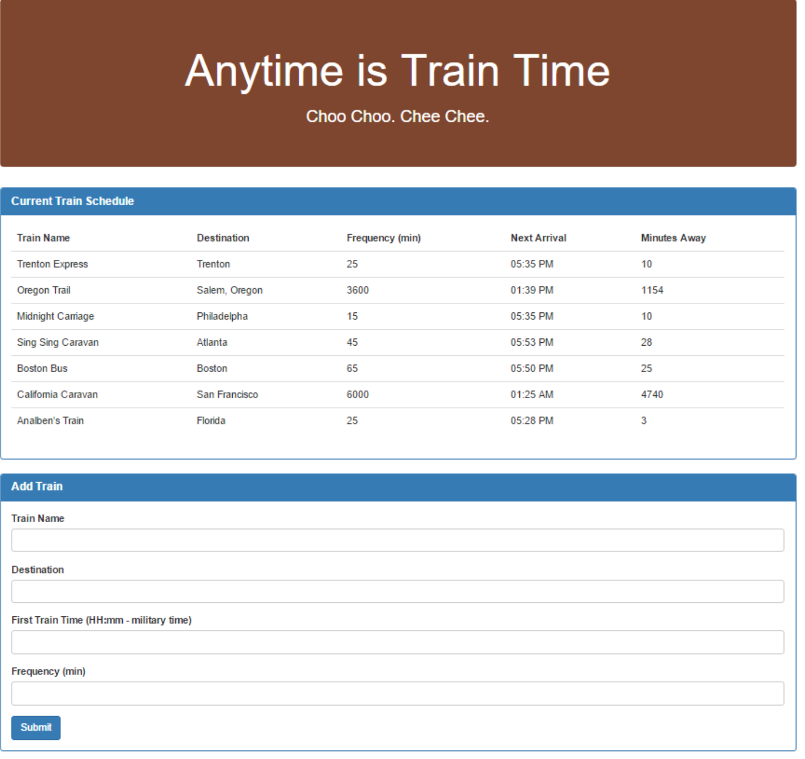
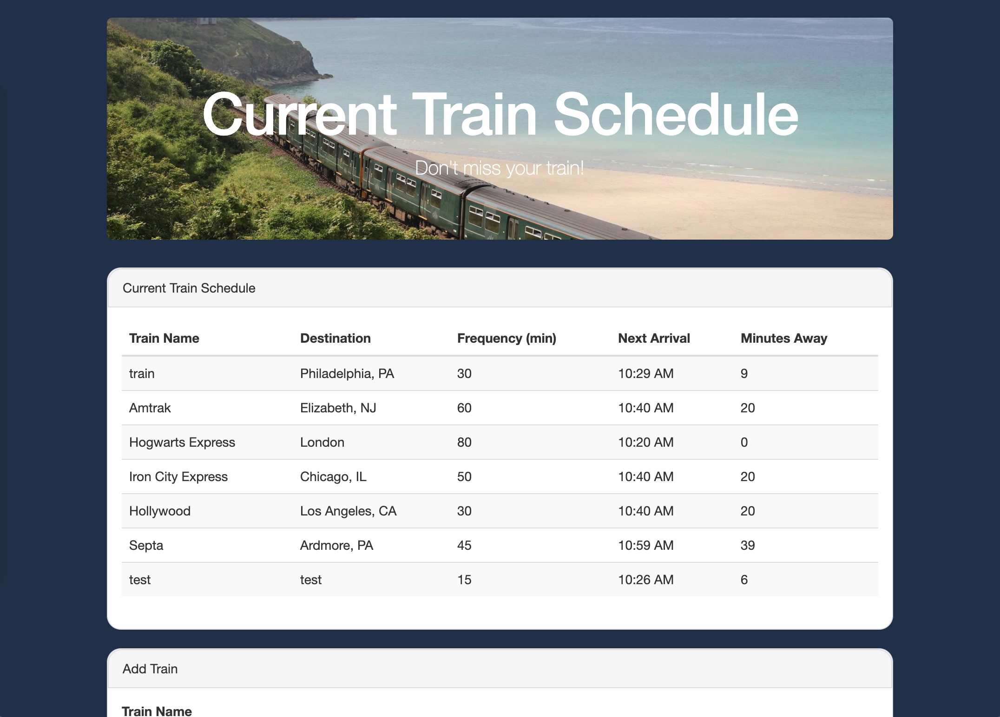

# Train-Scheduler

# About
This web application lets users enter information on any train and returns information on the next timed arrival and the frequency of the train. 

## How to use
On the form under Add Train, add the information on a train of your choice. After you have submitted this information, you will see your train on the board above, the next arrival of that train and how many minutes remain until they arrive at their station.

## Technologies Used
* JavaScript
* jQuery
* Bootstrap
* HTML/CSS
* Database: Firebase
* JS Library: Moment.js

## App Features
This app is using Firebase to keep and store data. The data is retrieved and manipulated with Moment.js. 

## Before and After

